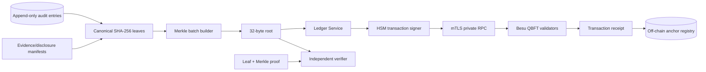

# Blockchain security architecture

## Purpose

The ledger proves that a set of off-chain records existed in a particular form at anchoring time and detects later tampering. It does not make allegations true, establish guilt, replace evidence law, protect a compromised endpoint, or guarantee fair investigation.

## Flow

## Privacy construction

- Tenant commitment: `HMAC-SHA256(ledger_tenant_key, tenant_uuid || rotation_epoch)`.
- Batch commitment: `SHA-256(random_batch_uuid || tenant_commitment || batch_kind)`.
- Leaves: hashes of canonical, content-minimised audit/evidence manifest records.
- Salt/HMAC keys remain off-chain in KMS/HSM and rotate by epoch.
- Do not anchor single events when timing could identify a reporter; use delayed, mixed batches with policy-defined minimum size.

## Governance

Validator operators should include independent control domains such as the platform operator, customer-appointed trustee/ombuds, external assurance provider and regional operator. Contract writer, administrator and emergency pauser are separate roles. Permissioning changes and role grants are themselves monitored and independently reviewed.

## Failure and recovery

The case platform remains available when the chain is unavailable. Anchor requests remain in an idempotent queue. A retry preserves the same root and batch commitment. If a root is rejected because it already exists, the service retrieves and records the existing transaction. Reconciliation compares off-chain registry, chain events and batch manifests.
