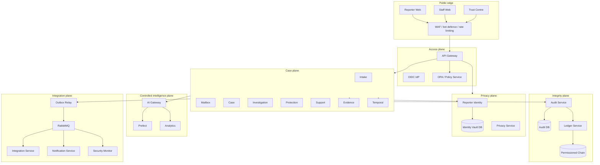

# Container and trust-boundary view

```mermaid
flowchart TB
  subgraph PublicZone[Public edge]
    RP[Reporter Web]
    SP[Staff Web]
    TC[Trust Centre]
    WAF[WAF / bot defence / rate limiting]
  end
  subgraph Access[Access plane]
    GW[API Gateway]
    IDP[OIDC IdP]
    PDP[OPA / Policy Service]
  end
  subgraph Core[Case plane]
    Intake[Intake]
    Mailbox[Mailbox]
    Cases[Case]
    Investigation[Investigation]
    Protection[Protection]
    Support[Support]
    EvidenceSvc[Evidence]
    Temporal[Temporal]
  end
  subgraph Privacy[Privacy plane]
    ReporterID[Reporter Identity]
    Vault[(Identity Vault DB)]
    PrivacySvc[Privacy Service]
  end
  subgraph Intelligence[Controlled intelligence plane]
    AIGW[AI Gateway]
    Prefect[Prefect]
    Analytics[Analytics]
  end
  subgraph Integrity[Integrity plane]
    Audit[Audit Service]
    AuditDB[(Audit DB)]
    Ledger[Ledger Service]
    Besu[(Permissioned Chain)]
  end
  subgraph Integration[Integration plane]
    MQ[RabbitMQ]
    Outbox[Outbox Relay]
    Integrations[Integration Service]
    Notify[Notification Service]
    Security[Security Monitor]
  end
  RP --> WAF --> GW
  SP --> WAF
  TC --> WAF
  GW --> PDP
  GW --> Core
  GW --> Privacy
  Core --> Temporal
  Core --> ReporterID --> Vault
  Core --> EvidenceSvc
  Core --> Outbox --> MQ
  MQ --> Integrations
  MQ --> Notify
  MQ --> Security
  Core --> Audit --> AuditDB
  Audit --> Ledger --> Besu
  Core --> AIGW --> Prefect
  AIGW --> Analytics
```
