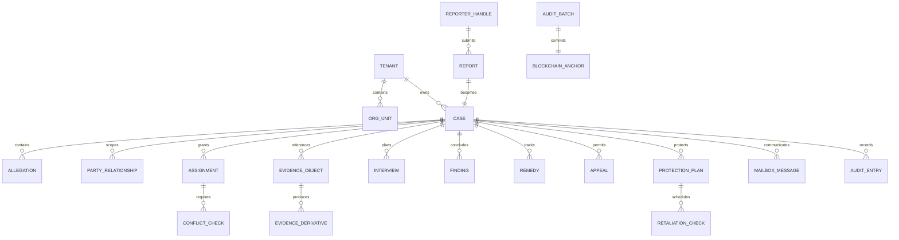

# Logical data model

Each bounded context owns its tables. Cross-service identifiers are opaque UUIDs or commitments; there are no cross-database foreign keys.

Identity-vault records are linked through independently generated opaque references and are not joinable by ordinary service credentials.
