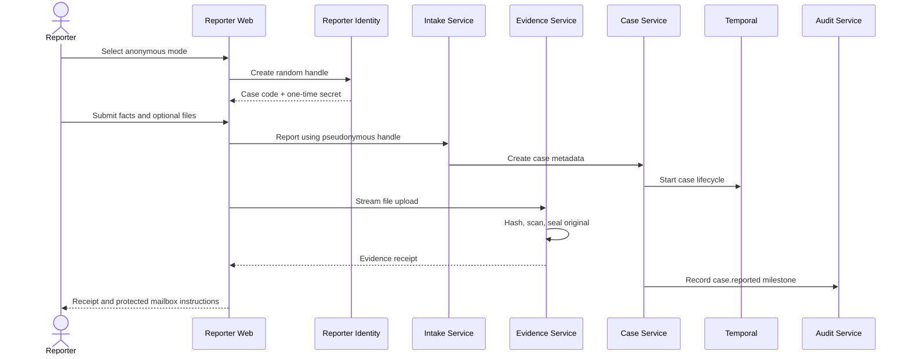

# Anonymous report sequence

```mermaid
sequenceDiagram
  actor R as Reporter
  participant W as Reporter Web
  participant RI as Reporter Identity
  participant I as Intake Service
  participant E as Evidence Service
  participant C as Case Service
  participant T as Temporal
  participant A as Audit Service

  R->>W: Select anonymous mode
  W->>RI: Create random handle
  RI-->>W: Case code + one-time secret
  R->>W: Submit facts and optional files
  W->>I: Report using pseudonymous handle
  I->>C: Create case metadata
  C->>T: Start case lifecycle
  W->>E: Stream file upload
  E->>E: Hash, scan, seal original
  E-->>W: Evidence receipt
  C->>A: Record case.reported milestone
  W-->>R: Receipt and protected mailbox instructions
```

The reporter secret is never placed in the case database, message bus, logs, analytics or blockchain.
