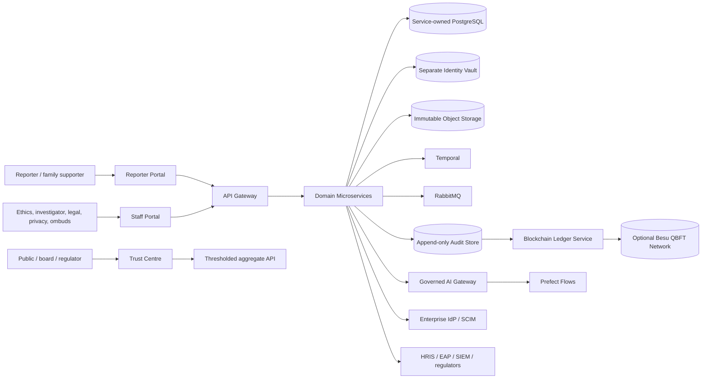

# System context

The reporter portal and identity vault form a distinct privacy realm. Staff cannot derive anonymous reporter identity from normal case APIs. Platform operators do not receive blanket case-content access.
